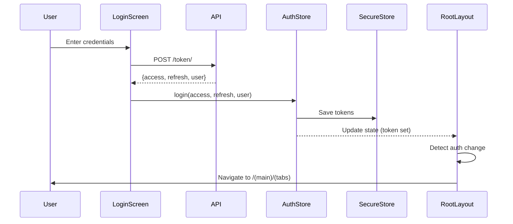

## Overview

AppBiblioteca implements a robust JWT (JSON Web Token) authentication system with:

- Token-based authentication using access and refresh tokens
- Secure token storage with expo-secure-store
- Automatic token refresh on expiration
- Protected routes with navigation guards
- Centralized auth state management with Zustand

## Authentication Flow

### Complete Login Flow



## Type Definitions

The authentication system uses TypeScript interfaces for type safety:

```typescript types/auth.ts
export interface User {
  id: number;
  username: string;
  email?: string;
}

export interface LoginResponse {
  access: string;
  refresh: string;
  user?: User; // Optional, depending on backend
}

export interface AuthState {
  user: User | null;
  token: string | null;
  refresh: string | null;
  isLoading: boolean;
  login: (
    token: string,
    refresh: string,
    userData: User | null,
    isLoading: boolean,
  ) => Promise<void>;
  logout: () => Promise<void>;
  initialize: () => Promise<void>;
}
```

## Auth Store Implementation

The authentication state is managed using Zustand in `store/useAuthStore.ts`:

```typescript store/useAuthStore.ts
import { create } from "zustand";
import * as SecureStore from "expo-secure-store";
import { AuthState } from "@/types/auth";

export const useAuthStore = create<AuthState>((set) => ({
  user: null,
  token: null,
  refresh: null,
  isLoading: true, // Start as true to block initial navigation

  login: async (token, refresh, userData) => {
    await SecureStore.setItemAsync("userToken", token);
    await SecureStore.setItemAsync("refreshToken", refresh);
    set({ token, refresh, user: userData, isLoading: false });
  },

  logout: async () => {
    await SecureStore.deleteItemAsync("userToken");
    await SecureStore.deleteItemAsync("refreshToken");
    set({ token: null, refresh: null, user: null, isLoading: false });
  },

  initialize: async () => {
    try {
      const token = await SecureStore.getItemAsync("userToken");
      // Set token (if exists) and always turn off isLoading
      set({ token, isLoading: false });
    } catch (error) {
      console.error("Error loading token:", error);
      set({ isLoading: false });
    }
  },
}));
```

### Store Methods

#### `login(token, refresh, userData)`

1. Saves tokens to secure storage
2. Updates store state with user data and tokens
3. Sets `isLoading` to `false`

#### `logout()`

1. Removes tokens from secure storage
2. Clears all auth state
3. Sets `isLoading` to `false`

#### `initialize()`

1. Called on app startup (in root layout)
2. Attempts to restore token from secure storage
3. Sets `isLoading` to `false` when complete

<Note>
The `isLoading` state is critical for preventing navigation flicker on app startup. It blocks navigation until we know if the user has a stored token.
</Note>

## Login Screen Implementation

The login screen from `app/(auth)/login.tsx` shows real-world usage:

```typescript app/(auth)/login.tsx
import React, { useState } from "react";
import { View, Text, TextInput, Button, Alert } from "react-native";
import { useRouter } from "expo-router";
import api from "@/api/axios";
import { useAuthStore } from "@/store/useAuthStore";
import { LoginResponse } from "@/types/auth";

export default function Login() {
  const [username, setUsername] = useState("");
  const [password, setPassword] = useState("");
  const login = useAuthStore((state) => state.login);
  const router = useRouter();

  const handleLogin = async () => {
    try {
      const { data } = await api.post<LoginResponse>("/token/", {
        username,
        password,
      });
      
      const { access, refresh, user } = data;
      await login(access, refresh, user || { id: 1, username }, true);
      
      // Navigation handled automatically by root layout
      router.replace("/(main)/profile");
    } catch (error) {
      Alert.alert(
        "Error",
        "Credenciales incorrectas. Por favor, inténtalo de nuevo.",
      );
    }
  };

  return (
    <View style={styles.container}>
      <Text>Login</Text>
      <TextInput
        style={styles.input}
        placeholder="Username"
        value={username}
        onChangeText={setUsername}
      />
      <TextInput
        style={styles.input}
        placeholder="Password"
        secureTextEntry={true}
        value={password}
        onChangeText={setPassword}
      />
      <Button title="Login" onPress={handleLogin} />
    </View>
  );
}
```

### Login Flow Steps

1. User enters credentials
2. Component calls API endpoint `/token/` with username and password
3. Backend validates and returns `{access, refresh, user}`
4. Component calls `login()` from auth store
5. Tokens are saved to secure storage
6. Auth state updates, triggering navigation guard
7. User is redirected to main app

## Token Storage with expo-secure-store

Tokens are stored securely using expo-secure-store:

<Tabs>
  <Tab title="iOS">
    Tokens are stored in the iOS Keychain, which provides:
    - Hardware-backed encryption
    - Protection even if device is jailbroken
    - Data persists across app reinstalls (unless explicitly deleted)
  </Tab>
  <Tab title="Android">
    Tokens are stored in Android KeyStore:
    - Hardware-backed encryption on supported devices
    - Protection against root access
    - Data persists in encrypted storage
  </Tab>
</Tabs>

### Storage Keys

- `userToken`: JWT access token
- `refreshToken`: JWT refresh token

<Warning>
Never store tokens in AsyncStorage or plain text. Always use SecureStore for sensitive data like authentication tokens.
</Warning>

## Automatic Token Refresh

The API layer in `api/axios.ts` implements automatic token refresh:

```typescript api/axios.ts
import axios from "axios";
import * as SecureStore from "expo-secure-store";
import { useAuthStore } from "@/store/useAuthStore";

const api = axios.create({
  baseURL: "http://localhost:8000/api",
});

// Request interceptor: Add token to all requests
api.interceptors.request.use(
  async (config) => {
    const token = await SecureStore.getItemAsync("userToken");
    if (token && config.headers) {
      config.headers.Authorization = `Bearer ${token}`;
    }
    return config;
  },
  (error) => Promise.reject(error),
);

// Response interceptor: Handle token refresh on 401
api.interceptors.response.use(
  (response) => response,
  async (error) => {
    const originalRequest = error.config;

    if (error.response?.status === 401 && !originalRequest._retry) {
      console.log("Token expired, attempting refresh...");
      originalRequest._retry = true;
      
      try {
        const refreshToken = await SecureStore.getItemAsync("refreshToken");
        if (!refreshToken) {
          return Promise.reject(error);
        }

        const response = await axios.post(
          "http://localhost:8000/api/token/refresh/",
          { refresh: refreshToken },
        );
        
        const { access } = response.data;
        await SecureStore.setItemAsync("userToken", access);
        originalRequest.headers.Authorization = `Bearer ${access}`;
        
        return api(originalRequest);
      } catch (refreshError) {
        console.log("Error refreshing token =>", refreshError);
        const { logout } = useAuthStore.getState();
        logout();
        return Promise.reject(refreshError);
      }
    }
    return Promise.reject(error);
  },
);

export default api;
```

### Token Refresh Flow

```
API Request → 401 Response
    │
    ▼
Check if retry attempted
    │
    ▼
Get refresh token from SecureStore
    │
    ▼
POST to /token/refresh/
    │
    ├─── Success ──→ Save new access token
    │                      │
    │                      ▼
    │                Retry original request
    │
    └─── Failure ──→ Call logout()
                           │
                           ▼
                     User redirected to login
```

<Note>
The `_retry` flag prevents infinite loops if the refresh token is also invalid.
</Note>

## Protected Routes & Navigation Guards

The root layout (`app/_layout.tsx`) implements navigation guards:

```typescript app/_layout.tsx
import { Slot, useRouter, useSegments, useRootNavigationState } from "expo-router";
import { useAuthStore } from "@/store/useAuthStore";
import { useEffect } from "react";
import { View, ActivityIndicator } from "react-native";

export default function RootLayout() {
  const token = useAuthStore((state) => state.token);
  const isLoading = useAuthStore((state) => state.isLoading);
  const initialize = useAuthStore((state) => state.initialize);
  const router = useRouter();
  const segments = useSegments();
  const navigationState = useRootNavigationState();

  // Initialize auth on mount
  useEffect(() => {
    initialize();
  }, []);

  // Navigation guard
  useEffect(() => {
    // Don't navigate if router isn't ready or still loading
    if (!navigationState?.key || isLoading) return;

    const inAuthGroup = segments[0] === "(auth)";

    if (!token && !inAuthGroup) {
      // No token and not in auth group → redirect to login
      router.replace("/login");
    } else if (token && inAuthGroup) {
      // Has token but in auth group → redirect to main app
      router.replace("/(main)/(tabs)");
    }
  }, [token, navigationState?.key, segments, isLoading, router]);

  // Show loading spinner while initializing
  if (isLoading) {
    return (
      <View style={{ flex: 1, justifyContent: "center", alignItems: "center" }}>
        <ActivityIndicator size="large" />
      </View>
    );
  }

  return <Slot />;
}
```

### Navigation Guard Logic

| User State | Current Location | Action |
|------------|-----------------|--------|
| No token | Auth screens | Allow |
| No token | Protected screens | Redirect to `/login` |
| Has token | Auth screens | Redirect to `/(main)/(tabs)` |
| Has token | Protected screens | Allow |

<Warning>
Always wait for `navigationState?.key` and `!isLoading` before performing navigation. Otherwise, you may encounter race conditions.
</Warning>

## Security Best Practices

### Implemented

- Tokens stored in encrypted secure storage
- HTTPS for API communication (production)
- Automatic logout on refresh token failure
- Request interceptors for consistent auth headers
- Loading state prevents unauthorized navigation

### Recommended

- Implement certificate pinning for production
- Add biometric authentication option
- Implement rate limiting on login attempts
- Add CSRF tokens for additional security
- Monitor for suspicious login patterns

## Common Patterns

### Accessing Auth State in Components

```typescript
import { useAuthStore } from "@/store/useAuthStore";

function MyComponent() {
  // Get specific state
  const user = useAuthStore((state) => state.user);
  const token = useAuthStore((state) => state.token);
  
  // Get actions
  const logout = useAuthStore((state) => state.logout);
  
  return (
    <View>
      <Text>Welcome, {user?.username}</Text>
      <Button title="Logout" onPress={logout} />
    </View>
  );
}
```

### Making Authenticated API Requests

```typescript
import api from "@/api/axios";

// Token is automatically added by request interceptor
const fetchUserData = async () => {
  try {
    const { data } = await api.get("/users/me");
    return data;
  } catch (error) {
    // 401 errors are handled automatically
    console.error(error);
  }
};
```

### Manual Logout

```typescript
import { useAuthStore } from "@/store/useAuthStore";

function LogoutButton() {
  const logout = useAuthStore((state) => state.logout);
  
  const handleLogout = async () => {
    await logout();
    // Navigation is handled automatically by root layout
  };
  
  return <Button title="Logout" onPress={handleLogout} />;
}
```

## Troubleshooting

### User gets logged out unexpectedly

- Check if refresh token is expired
- Verify backend refresh endpoint is working
- Check SecureStore for token persistence

### Navigation flicker on app startup

- Ensure `isLoading` state is properly managed
- Wait for `navigationState?.key` before navigation
- Check `initialize()` is called in root layout

### 401 errors on all requests

- Verify token is being added to headers (check interceptor)
- Check token format (`Bearer <token>`)
- Verify backend is accepting the token

## Next Steps

<CardGroup cols={2}>
  <Card title="Routing" icon="route" href="/concepts/routing">
    Learn about protected routes and navigation
  </Card>
  <Card title="State Management" icon="database" href="/concepts/state-management">
    Deep dive into Zustand stores
  </Card>
  <Card title="API Reference" icon="code" href="/api/auth-store">
    Explore authentication endpoints
  </Card>
  <Card title="Architecture" icon="sitemap" href="/concepts/architecture">
    Understand the overall architecture
  </Card>
</CardGroup>